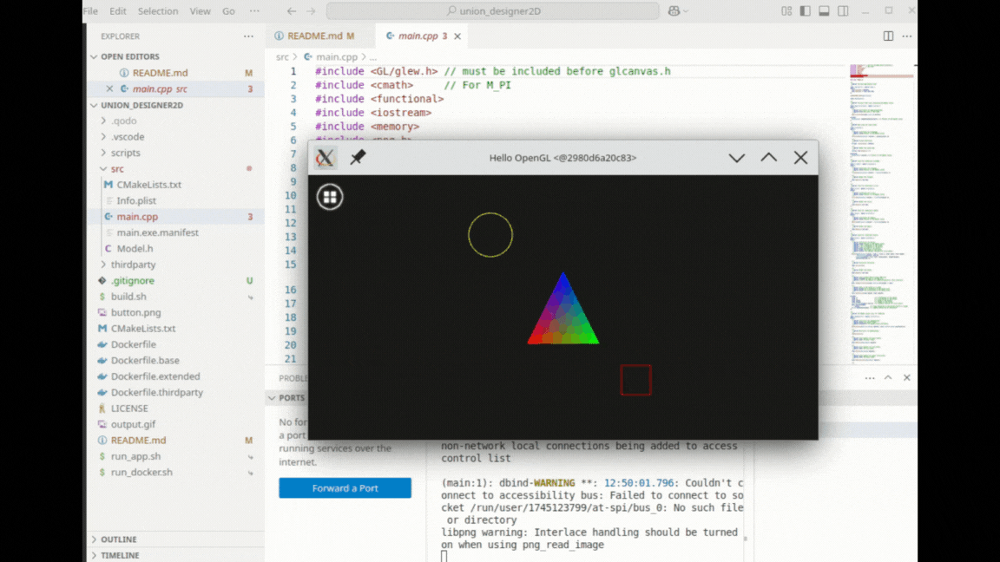
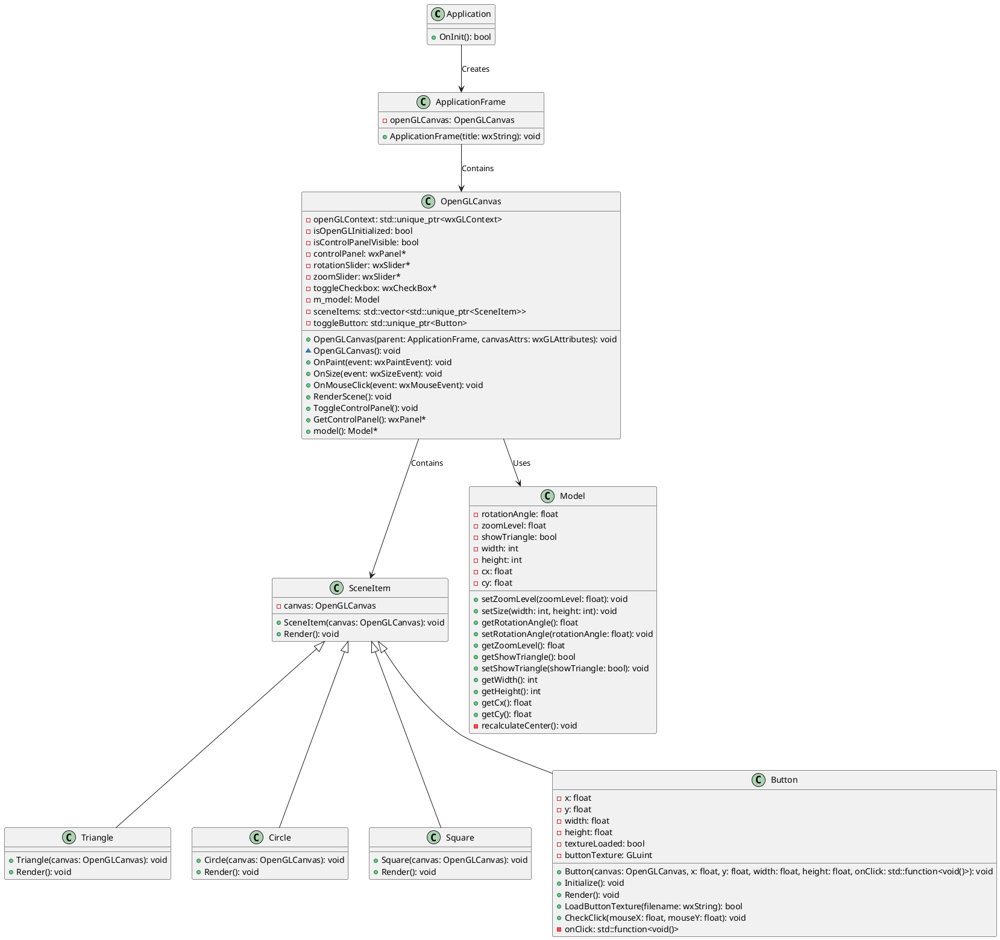
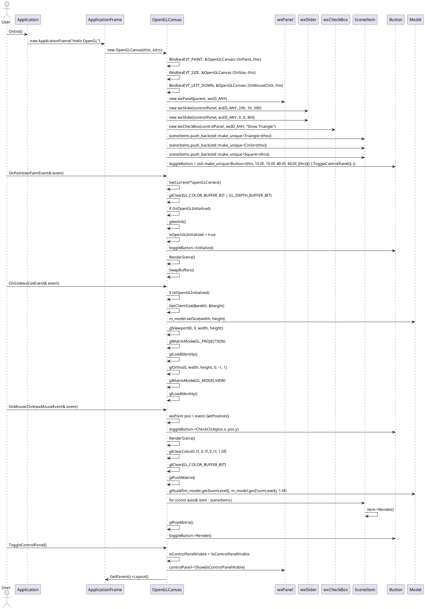

# Modern OpenGL App with wxWidgets

This project is a modern OpenGL application using wxWidgets as the UI framework to provide native OS controls for Mac, Windows, and Linux. The application demonstrates how to integrate OpenGL rendering with wxWidgets and render PNG images with transparent backgrounds.



## Features

- **Cross-Platform**: Works on Windows, Mac, and Linux.
- **Native UI**: Utilizes wxWidgets for native OS controls.
- **Modern OpenGL**: Uses core profile OpenGL for rendering.
- **Scene Management**: Implements a scene management system with various scene items (Triangle, Circle, Square, Button).
- **Dynamic Controls**: Includes dynamic controls for rotation, zoom, and visibility toggling.

## Warning

The project is still in development and has not been tested on MacOS and Windows platforms.

## How This Works

All the build and configuration steps are performed inside a Docker container. The container is built using the Dockerfile in the root directory of the project.

This project uses CMake to manage the build process. It searches for the wxWidgets library using `FindPackage`. If wxWidgets is not found, it downloads the library source from GitHub, compiles it, and links it with the main project using the super build pattern with `ExternalProject_Add`.

## Requirements

- **Linux**: Ubuntu 20.04 or later
- **Docker**: [Docker Installation Guide](https://www.docker.com/)

## Building the Project

To build the project, follow these steps:

1. **Clone the Repository**:

    ```bash
    git clone https://github.com/dkondratenko-dev/union_designer2D.git
    cd union_designer2D
    ```

2. **Build and Run the Project**:

    ```bash
    ./run.sh
    ```

    This step will use Docker to build the project and run it.

## Class diagram



## Sequence diagram



## Troubleshooting

If you encounter any issues during the build or run process, please check the console output for error messages and refer to the project's documentation for troubleshooting guides.

## Contributing

Contributions are welcome! Please open an issue or submit a pull request if you have any improvements or bug fixes.

## License

This project is licensed under the MIT License. See the [LICENSE](LICENSE) file for details.
